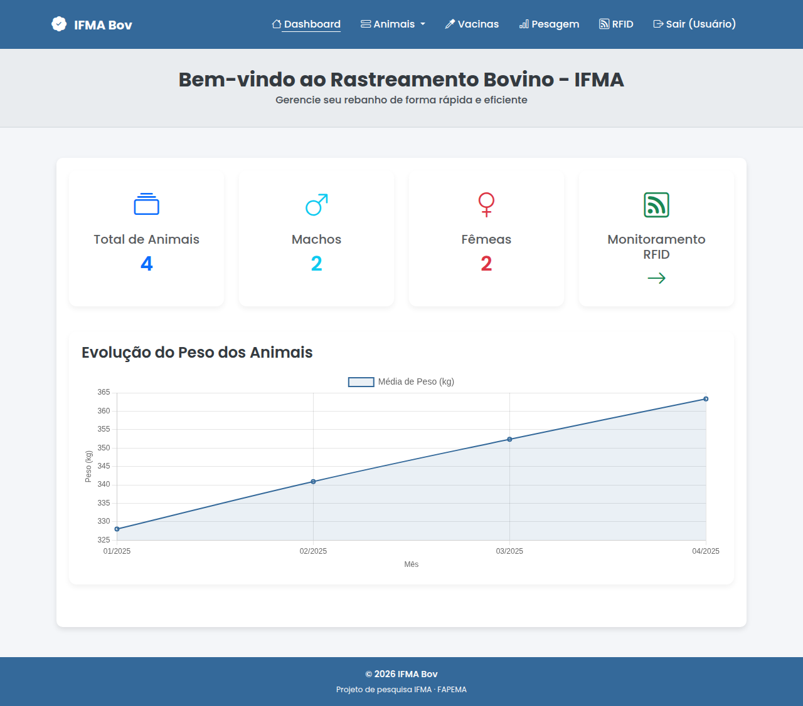
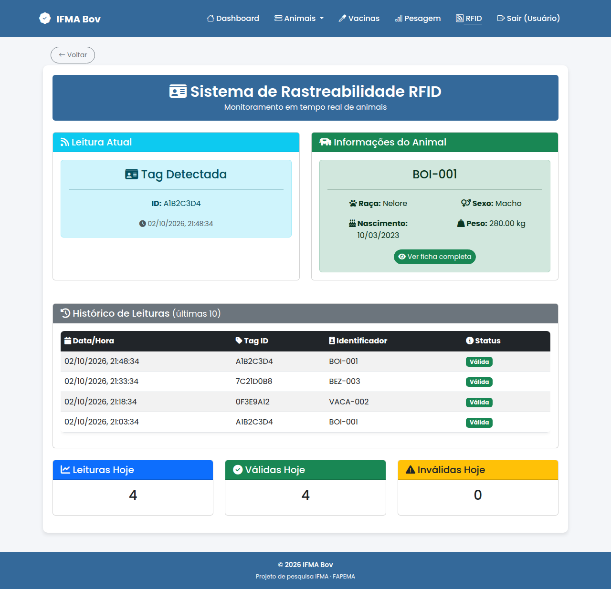
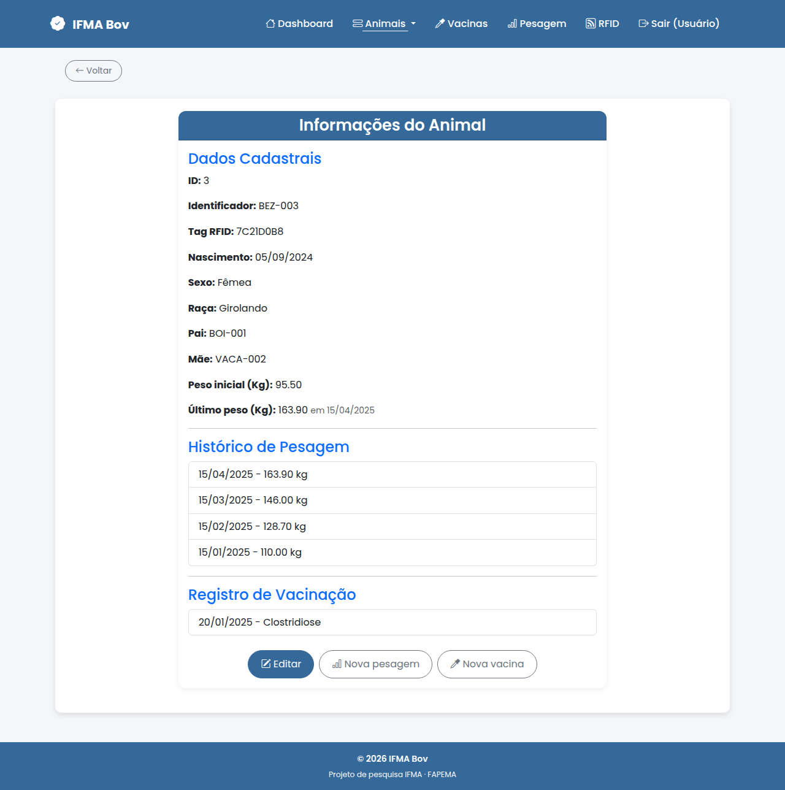
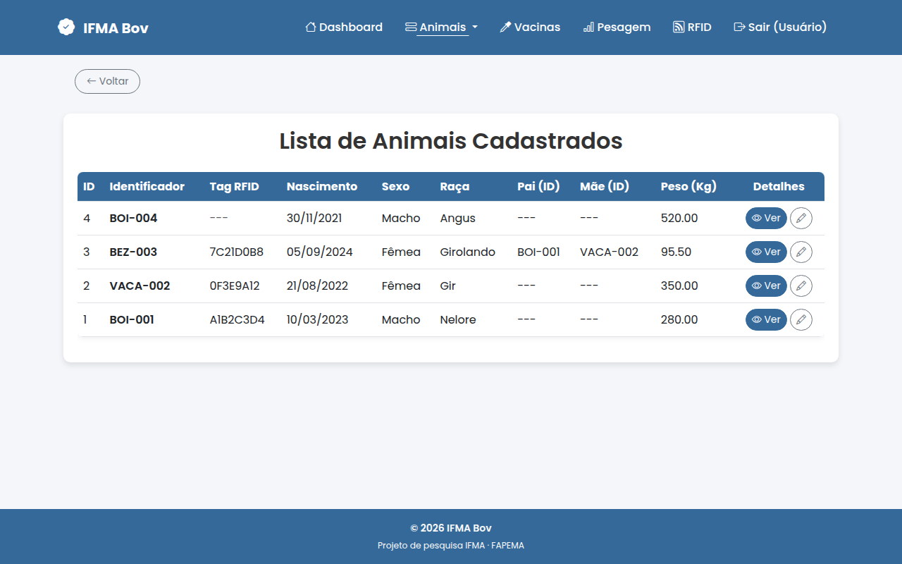
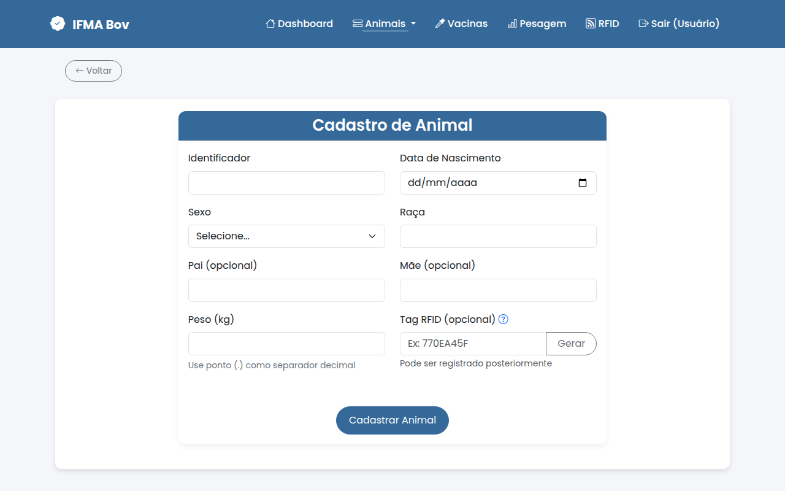
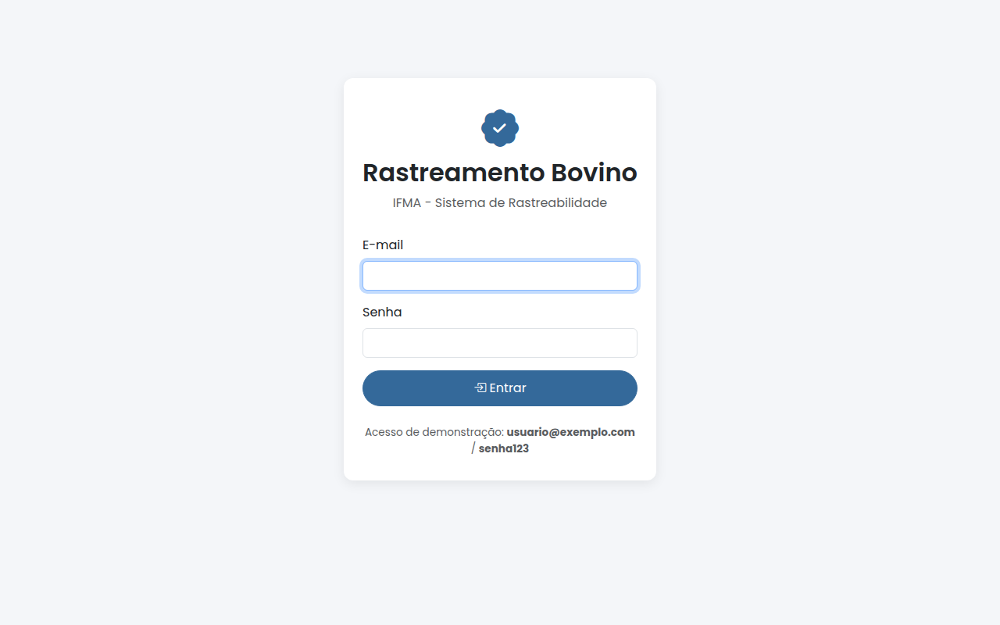
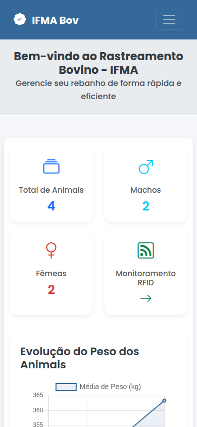

# 🐄 IFMA Bov — Sistema de Rastreabilidade Bovina com RFID

Sistema de rastreamento de bovinos que une **hardware (ESP32 + leitor RFID RC522)** e uma **aplicação web em PHP/MySQL** para identificar animais por brinco RFID e acompanhar cadastro, pesagens e vacinações.

Projeto de pesquisa desenvolvido no **IFMA** com apoio da **FAPEMA**, no ciclo **2024–2025**.



---

## ✨ Funcionalidades

**Aplicação web**
- Login com senha protegida por hash (`password_hash`) e sessão
- Painel inicial com total de animais, machos e fêmeas, e gráfico da evolução do peso médio
- Cadastro de animais: identificador, data de nascimento, sexo, raça, pai/mãe, peso inicial e tag RFID
- Lista paginada de animais, ficha completa (pesagens, vacinas, último peso) e edição
- Registro de pesagens e de vacinações
- **Monitoramento RFID em tempo real**: última tag lida, dados do animal, histórico das últimas leituras e estatísticas do dia (leituras válidas e de tags não cadastradas)
- Layout responsivo (computador e celular)

**Dispositivo (ESP32)**
- Leitura de tags RFID com o módulo RC522
- Envio da leitura por WiFi para a API do servidor
- Antiduplicação: a mesma tag só é registrada de novo após 10 segundos
- Reconexão automática ao WiFi e tratamento de erros
- Display OLED e LED indicador opcionais

## 📸 Telas

| Monitoramento RFID | Ficha do animal |
|---|---|
|  |  |

| Lista de animais | Cadastro |
|---|---|
|  |  |

| Login | Celular |
|---|---|
|  |  |

## 🔄 Como funciona

```
 Brinco RFID ──► RC522 + ESP32 ──WiFi/HTTP──► API PHP (api/rfid) ──► MySQL
                                                                     │
                                       Navegador ◄── páginas PHP ◄───┘
```

1. O animal passa pelo leitor e o ESP32 lê o ID da tag.
2. O ESP32 envia o `tag_id` para `api/rfid/esp32.php`.
3. A API registra a leitura no histórico e devolve os dados do animal (ou avisa que a tag não está cadastrada).
4. A tela de monitoramento consulta `api/rfid/read.php` a cada 2 segundos e mostra a leitura na hora.

## 🛠️ Tecnologias

| Camada      | Tecnologias                                    |
|-------------|------------------------------------------------|
| Hardware    | ESP32, RFID RC522, OLED SSD1306 128x64 (opcional) |
| Firmware    | Arduino (C++), MFRC522, ArduinoJson, Adafruit GFX/SSD1306 |
| Back-end    | PHP 8 (PDO), MySQL/MariaDB                     |
| Front-end   | HTML, Bootstrap 5, Chart.js, JavaScript        |
| Ambiente    | XAMPP ou Docker (Apache + PHP + MariaDB)       |

## 🚀 Como executar

### Opção 1: Docker (um comando)
Com o [Docker](https://www.docker.com/) instalado, na pasta do projeto:
```bash
docker compose up -d
```
Acesse **http://localhost:8080**. O banco já é criado com dados de exemplo.

### Opção 2: XAMPP
1. Instale o [XAMPP](https://www.apachefriends.org/) e inicie o **Apache** e o **MySQL**.
2. Copie o projeto para `htdocs/projeto_rastreabilidade`.
3. Importe o banco pelo phpMyAdmin (aba *Importar*) ou pelo terminal:
   ```bash
   mysql -u root < db/database.sql
   ```
   O banco já vem com dados de exemplo (4 animais, pesagens, vacinas e leituras RFID), para o sistema abrir preenchido.
4. Se o seu MySQL tiver outra senha ou outro usuário, ajuste [`includes/config.php`](includes/config.php).
5. Acesse `http://localhost/projeto_rastreabilidade`.

### 🔑 Acesso de demonstração
| E-mail | Senha |
|---|---|
| `usuario@exemplo.com` | `senha123` |

### Dispositivo ESP32

**Componentes:** ESP32 (qualquer modelo), módulo RFID RC522, tags RFID, cabo USB e, opcionalmente, display OLED 128x64 (I2C) e LED com resistor de 220 Ω.

**Ligações**

| RC522 | ESP32   | | OLED (opcional) | ESP32 |
|-------|---------|-|-----------------|-------|
| SDA   | GPIO 21 | | SDA             | GPIO 4  |
| SCK   | GPIO 18 | | SCL             | GPIO 15 |
| MOSI  | GPIO 23 | | VCC             | 3.3V    |
| MISO  | GPIO 19 | | GND             | GND     |
| RST   | GPIO 22 | | **LED (opcional)** | |
| 3.3V  | 3.3V    | | +               | GPIO 2  |
| GND   | GND     | | −               | GND (com resistor) |

**Gravação**
1. Na Arduino IDE, adicione as placas ESP32 (URL do gerenciador de placas:
   `https://espressif.github.io/arduino-esp32/package_esp32_index.json`) e selecione **ESP32 Dev Module**.
2. Instale as bibliotecas **MFRC522**, **ArduinoJson**, **Adafruit GFX** e **Adafruit SSD1306** (as duas últimas só com display).
3. Escolha o firmware:

   | Firmware | Quando usar |
   |---|---|
   | `esp32_rfid_rastreamento.ino` | Versão completa, com display OLED e LED |
   | `esp32_rfid_sem_display.ino` | Sem display: retorno pelo Monitor Serial e LED |
   | `esp32_rfid_simples.ino` + `config_esp32.h` | Tudo configurável no `.h` (display, LED e debug podem ser ligados ou desligados) |

4. Preencha o nome e a senha da sua rede WiFi (`SUA_REDE_WIFI` / `SUA_SENHA_WIFI`).
5. Ajuste o IP do computador onde o sistema está rodando. Para trocar em todos os firmwares de uma vez:
   ```bash
   ./atualizar_ip.sh 192.168.0.42
   ```
6. Envie para o ESP32 e acompanhe pelo Monitor Serial (115200 baud). Ao aproximar uma tag, aparece `Tag lida: A1B2C3D4` e a leitura surge na tela **RFID** do sistema.

Sem o hardware em mãos, dá para simular uma leitura:
```bash
curl -d "tag_id=A1B2C3D4" http://localhost:8080/projeto_rastreabilidade/api/rfid/esp32.php
```

**Solução de problemas**
- *WiFi não conecta:* confira nome e senha da rede; o ESP32 só funciona em redes 2,4 GHz.
- *Tags não são lidas:* revise as ligações e alimente o RC522 com 3.3V (não 5V).
- *Erro HTTP ao enviar:* confira o IP do servidor e se o Apache está rodando; ESP32 e computador precisam estar na mesma rede.
- *Display não liga:* confira SDA/SCL e o endereço I2C (geralmente `0x3C`).

## 📁 Estrutura do projeto

```
├── api/rfid/
│   ├── esp32.php              # recebe as leituras do ESP32
│   └── read.php               # estado atual para a tela de monitoramento
├── assets/                    # CSS, JS e imagens
├── db/
│   └── database.sql           # criação do banco "ifmabov", das tabelas e dados de exemplo
├── docker/                    # imagem Apache + PHP usada pelo docker-compose
├── docs/screenshots/          # imagens deste README
├── includes/                  # configuração, login (auth), header e footer
├── pages/                     # páginas do sistema (painel, cadastro, pesagem, vacinas...)
├── login.php / logout.php     # entrada e saída do sistema
├── esp32_rfid_*.ino           # firmwares do ESP32
├── config_esp32.h             # configurações do firmware simplificado
├── atualizar_ip.sh            # troca o IP do servidor em todos os firmwares
└── docker-compose.yml         # sobe o sistema completo com Docker
```

## 🗄️ Banco de dados

Banco `ifmabov` com as tabelas:

- **animais**: dados do animal e tag RFID vinculada
- **historico_leitura**: cada leitura RFID com data e hora (inclusive de tags ainda não cadastradas)
- **pesagem**: histórico de pesos por animal
- **vacinas**: histórico de vacinação por animal
- **usuarios**: usuários do sistema (senha com hash)

## 🔒 Segurança

- Senhas guardadas com `password_hash` / `password_verify`
- Consultas com *prepared statements* (PDO), contra SQL injection
- Dados exibidos com `htmlspecialchars`, contra XSS
- Páginas internas exigem login
- `.htaccess` bloqueia acesso direto a configuração, logs, scripts SQL e firmware, além da listagem de pastas

## 🔭 Próximos passos

- Cadastro e gerenciamento de usuários pela interface
- Relatórios exportáveis (PDF/planilha)
- Leitura offline no ESP32 com envio posterior

## 👤 Autor

**Erdeson Monteiro**: [github.com/Erdeson-Monteiro](https://github.com/Erdeson-Monteiro)

Projeto desenvolvido com apoio da Fundação de Amparo à Pesquisa e ao Desenvolvimento Científico e Tecnológico do Maranhão (**FAPEMA**) no Instituto Federal do Maranhão (**IFMA**).

## 📄 Licença

Distribuído sob a licença MIT. Veja [LICENSE](LICENSE).
